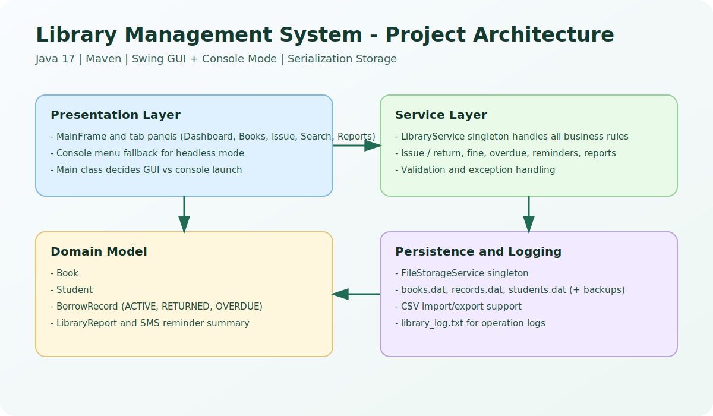
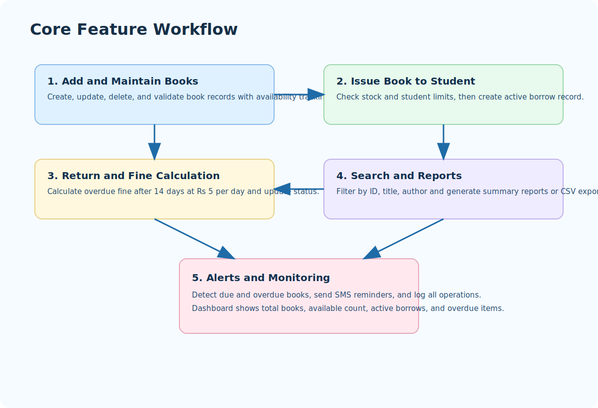
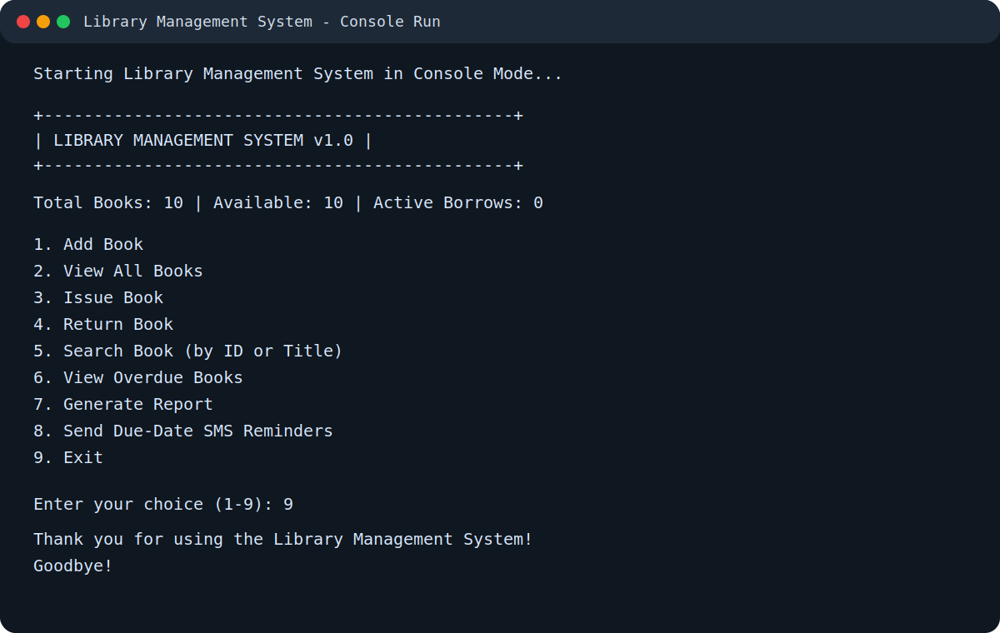

# PROJECT REPORT

## 1. Student Details
- Name: HARIKRISHNAN A
- Roll Number: 24EC029
- Project Title: Library Management System
- Academic Type: Java Course Project

## 2. Repository and Deployment Links
- Repository: https://github.com/Harikrishnan120A/library-management-system
- Deployed Project Site: https://harikrishnan120a.github.io/library-management-system/

## 3. Abstract
The Library Management System is a Java desktop application developed to simplify and automate core library operations. The system supports both a Swing GUI mode and a console mode. It helps librarians manage books, issue and return operations, overdue tracking, fine calculation, reports, CSV import/export, and SMS reminders.

## 4. Problem Statement
Manual library management is often time consuming and prone to data errors. There is a need for a system that can:
- Maintain accurate book records
- Track issue and return transactions
- Detect overdue books automatically
- Compute fines consistently
- Provide searchable and exportable reports

## 5. Objectives
- Build a robust object oriented Java application for library workflows
- Provide a user friendly Swing interface and console fallback
- Implement clean module separation with reusable service logic
- Persist data locally using serialization
- Support reporting and alerts for better library operations

## 6. Technology Stack
| Component | Technology |
|---|---|
| Programming Language | Java 17 |
| Build Tool | Maven |
| UI | Java Swing |
| Persistence | Java Object Serialization (.dat) |
| Logging | java.util.logging |
| Optional Alerts | HTTP Gateway or Twilio SMS |

## 7. High Level Architecture

The application follows layered design:
- Presentation Layer: GUI panels and console menu
- Service Layer: Core business logic via LibraryService
- Domain Layer: Book, Student, BorrowRecord, and report models
- Persistence Layer: FileStorageService for serialized files and backups

## 8. Core Workflow

Main workflow:
- Book records are added and managed
- Books are issued to students with validations
- Returns update status and fines when overdue
- Reports summarize activity and enable CSV export
- SMS reminders can notify users of due or overdue books

## 9. Key Features Implemented
- Add, edit, and delete books with validation
- Issue and return books with stock management
- Fine calculation after 14 day borrow period
- Overdue record detection and highlighting
- Search by ID, title, or author
- Dashboard statistics for quick monitoring
- Report generation with most borrowed books
- CSV import/export for book data
- Data persistence with backup files
- Log recording for operations

## 10. OOP Concepts Demonstrated
- Encapsulation: Private fields with controlled access in model classes
- Inheritance: Custom exception classes
- Polymorphism: Swing table models and renderers
- Abstraction: Service layer hides business rules from UI
- Singleton Pattern: LibraryService and FileStorageService
- Enum Usage: BorrowRecord status states

## 11. Sample Output (Console Mode)

## 12. Project Structure
- src/main/java/com/library/Main.java
- src/main/java/com/library/model/
- src/main/java/com/library/service/
- src/main/java/com/library/ui/
- src/main/java/com/library/util/
- src/main/java/com/library/exception/

## 13. Conclusion
This project successfully delivers a complete desktop library management solution with practical features and clean object oriented architecture. It is suitable for academic demonstration and can be extended further for real world usage.

## 14. Future Enhancements
- Database integration (MySQL or PostgreSQL)
- User authentication and role based access
- Online deployment with REST API and web frontend
- Barcode or QR based issue/return support
- Email and WhatsApp alert integrations
